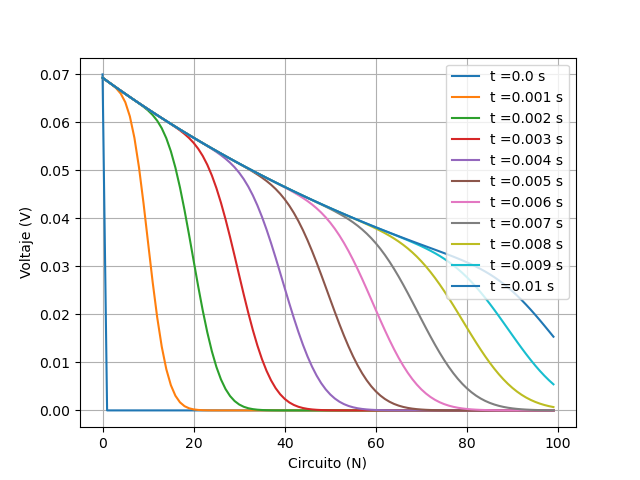
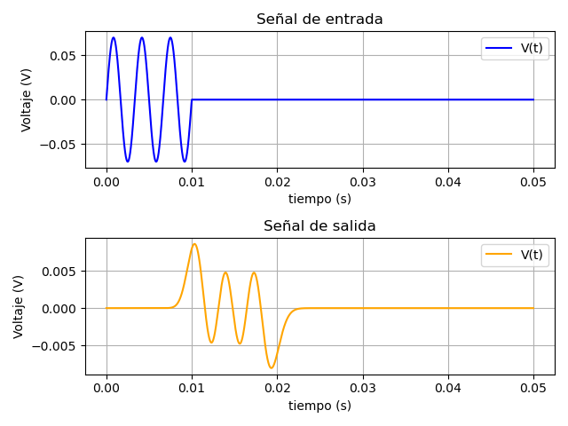
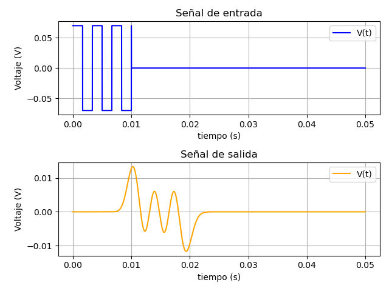

# Simulación de señales neuronales

En este repositorio se encuentran algunos scripts para la simulación de señales neuronales mediantes circuitos RC.

En el archivo [Axon_Model.py](https://github.com/Luis2501/Neural-signal-simulation/blob/main/Axon_Model.py), se encuentra la clase `Axon` mediante la cual se resuleve el sistema de ecuaciones diferenciales. 

Para conocer más acerca del tema, puede visitar el siguiente enlace:

[Modelación y simulación de señales neuronales con circuitos RC](https://luis2501.github.io/Simulating-Signal-Neural.html)

# Resultados

A continuación se muestran algunos resultados obtenidos.

## Voltaje através de los circuitos

## Señal sinusoidal

## Señal cuadrada

